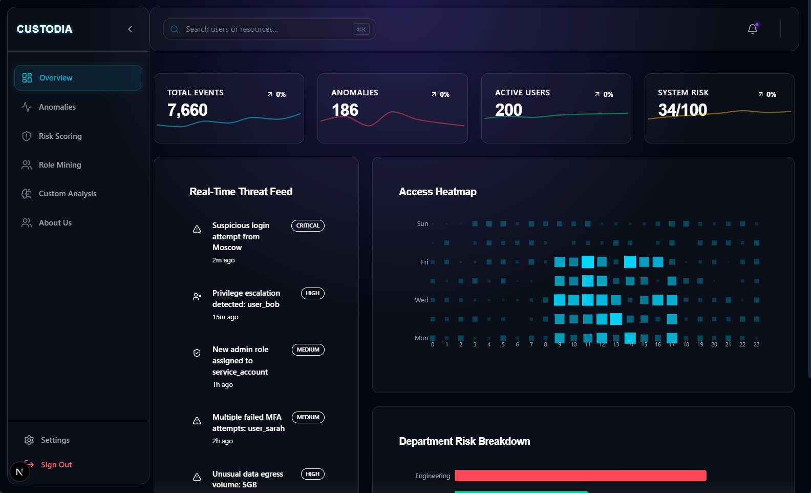
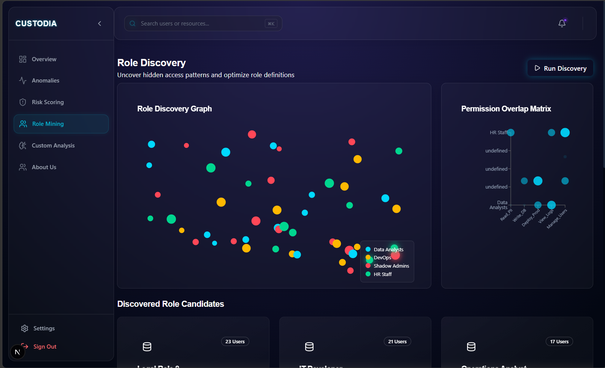
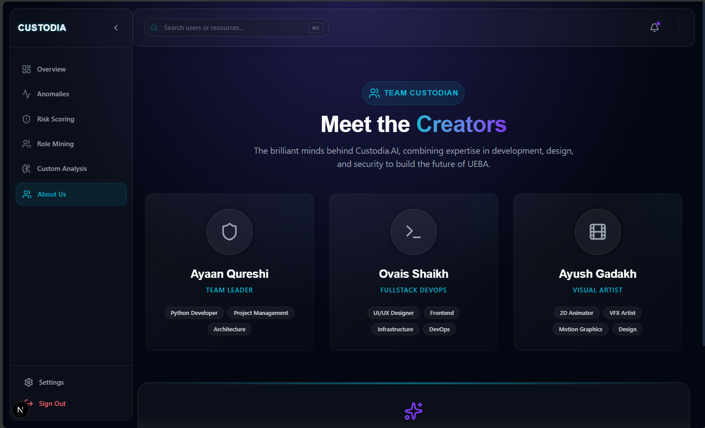

<div align="center">

# 🛡️ Custodia.AI

### AI-Powered Identity Threat Detection & User Behavior Analytics Platform

*Leveraging Machine Learning to Secure Modern Identity and Access Management*


---

### 🚀 Intelligent Identity Protection through AI

Detect anomalous user behaviour, optimise RBAC roles, calculate dynamic risk scores and strengthen enterprise IAM using Machine Learning.

</div>

---

# 📖 Overview

Custodia.AI is an AI-powered cybersecurity platform focused on **Identity and Access Management (IAM)** and **User & Entity Behaviour Analytics (UEBA).**

Instead of relying solely on predefined security rules, Custodia.AI continuously learns how users normally interact with enterprise resources and detects deviations that may indicate compromised accounts, insider threats, privilege abuse, or suspicious access behaviour.

The platform combines machine learning, behavioural analytics, role mining and interactive visualisations into a modern security dashboard designed for SOC teams and security analysts.

---

# ✨ Features

## 🔐 Identity & Access Security

- User Behaviour Analytics (UEBA)
- Identity Threat Detection
- Insider Threat Detection
- Dynamic Risk Scoring
- Privilege Abuse Detection
- Access Pattern Monitoring
- Role Based Access Control (RBAC)
- AI-powered Security Insights

---

## 🤖 Machine Learning

- Isolation Forest Anomaly Detection
- Behavioural Risk Prediction
- Role Mining Algorithms
- Feature Engineering Pipeline
- Continuous Risk Assessment
- Intelligent Role Recommendation

---

## 📊 Security Dashboard

- Real-time Analytics
- Risk Heatmaps
- Threat Timelines
- Department Analysis
- Role Discovery
- Behaviour Trends
- Interactive Charts
- Security Recommendations

---

# 🖼️ Screenshots

## Dashboard

<p align="center">

</p>

---

## Role Mining

<p align="center">

</p>

---

## Team

<p align="center">

</p>

---

# 🧠 AI Pipeline

```text
Enterprise Logs
        │
        ▼
Feature Engineering
        │
        ▼
Behaviour Analysis
        │
        ▼
Isolation Forest
        │
        ▼
Risk Score Engine
        │
        ▼
Threat Detection
        │
        ▼
Security Dashboard
```

---

# 🏗 System Architecture

```text
                    ┌─────────────────────┐
                    │   Enterprise Logs   │
                    └──────────┬──────────┘
                               │
                               ▼
                  ┌────────────────────────┐
                  │ Feature Engineering    │
                  └──────────┬─────────────┘
                             │
             ┌───────────────┼────────────────┐
             ▼               ▼                ▼
     Isolation Forest   Risk Engine    Role Mining
             │               │                │
             └───────────────┼────────────────┘
                             ▼
                   Threat Intelligence
                             │
                             ▼
                    Interactive Dashboard
```

---

# 📈 Dashboard Modules

| Module | Description |
|---------|-------------|
| 📊 Overview | System health and security metrics |
| 🚨 Anomalies | AI detected suspicious behaviour |
| ⚠ Risk Scoring | Dynamic user risk calculation |
| 👥 Role Mining | Discover hidden RBAC roles |
| 🧠 Custom Analysis | Advanced ML analytics |
| 👤 About Team | Project contributors |

---

# ⚙ Technology Stack

## Frontend

- Next.js
- React
- TypeScript
- Tailwind CSS
- Framer Motion
- Recharts

---

## Backend

- FastAPI
- Python
- Uvicorn

---

## Machine Learning

- Scikit-Learn
- TensorFlow
- Pandas
- NumPy

---

## Security

- CrowdStrike Falcon
- UEBA
- RBAC
- IAM

---

## Deployment

- Docker
- Docker Compose

---

# 🚀 Installation

```bash
git clone https://github.com/OVAIS69/Custodia.ai.git

cd Custodia.ai
```

---

### Backend

```bash
cd backend

pip install -r requirements.txt

uvicorn main:app --reload
```

---

### Frontend

```bash
cd frontend

npm install

npm run dev
```

---

# 📂 Project Structure

```
Custodia.AI

├── frontend
│
├── backend
│
├── ml_models
│
├── datasets
│
├── docker
│
├── documentation
│
└── README.md
```

---

# 🛡 Security Capabilities

✔ Behaviour Analytics

✔ Identity Risk Assessment

✔ Privilege Escalation Detection

✔ Insider Threat Monitoring

✔ AI Anomaly Detection

✔ Role Mining

✔ Permission Analysis

✔ Access Intelligence

---

# 📊 Future Roadmap

- [ ] LLM Security Assistant
- [ ] Multi-Cloud IAM Support
- [ ] Azure AD Integration
- [ ] AWS IAM Integration
- [ ] Real-time Streaming Detection
- [ ] Graph Neural Networks
- [ ] Explainable AI
- [ ] SIEM Integration
- [ ] Zero Trust Recommendations

---

# 👨‍💻 Team

| Name | Role |
|------|------|
| **Ayaan Qureshi** | Team Lead |
| **Ovais Shaikh** | Full Stack & DevOps |
| **Ayush Gadakh** | Visual Artist |

---

# 📜 License

This project is licensed under the MIT License.

---

<div align="center">

## ⭐ If you like this project, consider giving it a star!

Made with ❤️ by Team Custodian

</div>
